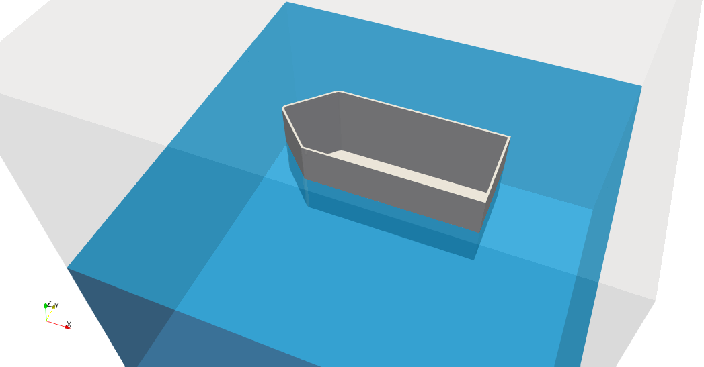

# floodField

OpenFOAM utility for setting initial alpha.water field in interFoam simulations with free surface flow.

## Description

`floodField` is a preprocessing tool designed to initialize the `alpha.water` field for interFoam simulations involving free surface flows, particularly useful when simulating scenarios with floating objects (e.g., a boat with an empty hull).

The standard `setFields` utility does not adequately handle cases where the water surface intersects with complex geometries. `floodField` solves this by using a flood-fill algorithm that:

1. Reads the mesh and initializes all `alpha.water` values to 0
2. Locates cells containing user-defined seed points (known to be underwater and outside solid regions)
3. Performs a breadth-first search from seed points, filling connected cells with water (`alpha.water = 1`) as long as they remain below the water surface

This approach naturally handles complex geometries like boat hulls, ensuring water is only placed in valid regions below the free surface.

## Water Surface Definition

The water surface is defined by:
- **Gravity vector**: Read from `constant/g` (determines the direction of "down")
- **Water level**: A scalar value representing the projection along the `-g` direction

For standard gravity `(0 0 -9.81)`, a water level of `5` corresponds to `z = 5 m`.

## Directory Structure

```
floodField/
├── floodField.C          # Main application source
├── floodFieldDict        # Example configuration file
└── Make/
    ├── files             # Build configuration
    └── options           # Compiler/linker flags

tutorials/floodField/
├── Allrun                # Script to run the tutorial
├── Allclean              # Script to clean the tutorial
├── system/
│   ├── blockMeshDict     # Background mesh definition
│   ├── snappyHexMeshDict # Mesh refinement settings
│   ├── fvSchemes         # Discretization schemes
│   ├── fvSolution        # Solver settings
│   └── controlDict       # Time control
├── constant/
│   ├── g                 # Gravity vector
│   ├── transportProperties
│   └── triSurface/
│       └── boat.stl      # Boat hull geometry
└── floodedDomain.png     # Visualization of result
```



## Compilation

To compile the utility, run:

```bash
cd floodField
wmake
```

The compiled executable will be placed in `$FOAM_USER_APPBIN/floodField`.

## Configuration

Copy `floodFieldDict` to `system/floodFieldDict` in your case directory:

```cpp
// Water level as scalar projection along -g direction
// With gravity (0 0 -9.81), waterLevel 5 means z = 5 m
waterLevel 5;

// Seed points guaranteed to be underwater and outside solid regions
seedPoints
(
    (9 9 2)      // x y z coordinates
);
```

## Usage

1. Prepare your mesh using e.g. `blockMesh` and optionally `snappyHexMesh`:
   ```bash
   blockMesh
   snappyHexMesh -overwrite
   ```

2. Run `floodField`:
   ```bash
   floodField
   ```

3. The utility will create/update the `alpha.water` field in the time directory.

## Algorithm

The flood-fill algorithm works as follows:

1. Initialize all `alpha.water` values to 0
2. For each seed point, find the containing cell and add it to a queue
3. While the queue is not empty:
   - Pop a cell from the queue
   - Check all neighboring cells
   - If a neighbor has `alpha.water = 0` and its center is below the water surface (projection along `-g` < waterLevel), set `alpha.water = 1` and add to queue

## Example

See `tutorials/floodField/` for a complete example case featuring:
- A 10×10×10 m domain
- Water level at z = 5 m
- A boat hull (2D shell without top face)

## License

This utility is provided as-is for use with OpenFOAM.
